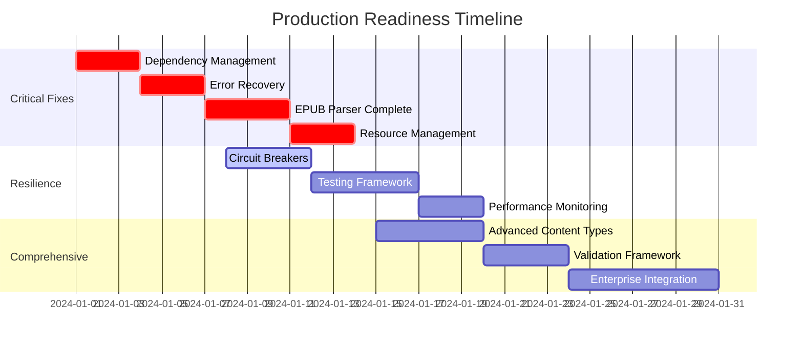

# Unified Unstructured Data Framework

**⚠️ DEVELOPMENT STATUS: Early Stage - Not Production Ready**

This repository provides a unified document model and processing pipeline for unstructured data across Web, PDF, DOCX, EPUB, and Markdown. It separates concerns into three layers:

- `doc/`: canonical, format-agnostic document classes (the unified model)
- `scrapers/`: web scraping to populate the model from HTML/websites  
- `parsers/`: file-format parsers to populate the model from PDFs/DOCX/EPUB/MD/YAML

The goal is consistent interpretation of content regardless of source, enabling downstream analytics, search, and knowledge systems.

## 🚨 **CRITICAL SYSTEM ASSESSMENT**

**Current Maturity Level: 5/10 (Early Development)**

### ✅ **What's Working Well**
- **Excellent Architectural Vision**: Unified document model is brilliantly designed
- **Advanced Web Scraper**: Enterprise-grade features with circuit breakers, multilingual support
- **Clean Code Structure**: Well-organized modules with clear separation of concerns
- **Rich Document Model**: Comprehensive serialization, NLP integration, cross-format compatibility

### ❌ **Critical Issues Preventing Production Use**
- **Fragile Dependency Management**: Hard dependencies cause crashes when libraries missing
- **Incomplete Parser Implementations**: EPUB parser has only 18 lines, YAML parser is minimal
- **Missing Error Recovery**: No fallback mechanisms or graceful degradation
- **No Production Monitoring**: No observability, metrics, or health checks
- **Limited Testing Coverage**: Minimal integration tests, no load testing
- **Missing Resource Management**: No memory limits, timeouts, or cleanup

**🎯 Estimated Effort to Production Ready: 6-8 weeks of focused development**

## 🛠️ **ROADMAP TO ROBUST, RESILIENT & COMPREHENSIVE**

### **Phase 1: Critical Robustness Fixes (Week 1-2)**

#### 1.1 Dependency Management Overhaul
```python
# Replace fragile imports with capability-based system
class DependencyManager:
    def __init__(self):
        self.capabilities = self._detect_capabilities()
    
    def require_capability(self, capability: str) -> bool:
        if not self.capabilities.get(capability, False):
            raise CapabilityUnavailableError(
                f"{capability} required but not available. "
                f"Install: pip install {CAPABILITY_PACKAGES[capability]}"
            )
        return True
```

#### 1.2 Comprehensive Error Recovery
```python
class ParsingResult:
    def __init__(self, document: Optional[Document] = None, 
                 errors: List[ParseError] = None,
                 partial_success: bool = False):
        self.document = document
        self.errors = errors or []
        self.partial_success = partial_success
    
    def to_recovery_document(self) -> Document:
        # Create minimal document even on failure
        return Document(title="Parse Error Recovery", errors=self.errors)
```

#### 1.3 Production Monitoring
```python
class SystemHealthMonitor:
    def track_parsing_operation(self, file_path: str, parser_type: str):
        with self.performance_tracker.track_operation(f"parse_{parser_type}"):
            # Track memory, CPU, success rates, error patterns
            return self._execute_with_monitoring(file_path, parser_type)
```

### **Phase 2: Resilience Architecture (Week 3-4)**

#### 2.1 Parser Circuit Breakers
```python
class ResilientParser:
    def __init__(self):
        self.circuit_breaker = CircuitBreaker(
            failure_threshold=5,
            recovery_timeout=300,
            fallback_function=self._fallback_parse
        )
    
    @circuit_breaker
    def parse(self, file_path: str) -> Document:
        return self._internal_parse(file_path)
```

#### 2.2 Resource Management
```python
class ResourceManagedParser:
    def parse_with_limits(self, file_path: str) -> Document:
        with self.resource_monitor.enforce_limits(
            memory_limit=self.max_memory,
            time_limit=self.max_processing_time
        ):
            return self._internal_parse(file_path)
```

#### 2.3 Distributed Processing
```python
class DistributedParsingCluster:
    async def parse_batch(self, file_paths: List[str]) -> List[ParsingResult]:
        # Multi-node processing with Redis/Celery
        tasks = [self.submit_parsing_task(path) for path in file_paths]
        return await asyncio.gather(*tasks, return_exceptions=True)
```

### **Phase 3: Comprehensive Feature Set (Week 5-6)**

#### 3.1 Complete Parser Implementations
- **EPUB Parser**: Full metadata extraction, chapter hierarchy, image processing
- **Advanced PDF**: Mathematical formulas, interactive elements, annotations
- **Enhanced DOCX**: Track changes, comments, embedded objects
- **Rich Markdown**: Extensions, code highlighting, mathematical notation

#### 3.2 Advanced Content Types
```python
class Formula(DataElement):
    def __init__(self, latex: str, rendered_path: Optional[str] = None):
        self.latex = latex
        self.rendered_path = rendered_path

class InteractiveElement(DataElement):
    def __init__(self, element_type: str, properties: Dict):
        self.element_type = element_type  # form, button, link
        self.properties = properties
```

#### 3.3 Validation Framework
```python
class DocumentValidator:
    def validate_document(self, document: Document) -> ValidationResult:
        # Schema validation, content quality checks, structure validation
        return ValidationResult.combine([
            self.schema_validator.validate(document.to_dict()),
            self.content_validator.validate(document),
            self.structure_validator.validate(document)
        ])
```

### **Phase 4: Production Excellence (Week 7-8)**

#### 4.1 Comprehensive Testing
- **Unit Tests**: 90%+ coverage for all parsers
- **Integration Tests**: End-to-end workflows across all formats
- **Load Testing**: Large document processing, memory usage validation
- **Chaos Testing**: Dependency failure scenarios, resource exhaustion

#### 4.2 Performance Optimization
- **Async Processing**: Parallel document processing
- **Streaming Parsers**: Memory-efficient large file handling
- **Intelligent Caching**: Version-aware result caching
- **Resource Pooling**: Connection and object pooling

#### 4.3 Enterprise Integration
- **REST API**: Production-ready API with OpenAPI specification
- **Database Integration**: PostgreSQL/MongoDB support for document storage
- **Message Queues**: RabbitMQ/Redis for async processing
- **Container Deployment**: Docker/Kubernetes manifests

## 📊 **SYSTEM HEALTH SCORECARD**

| Dimension | Current | Target | Critical Issues |
|-----------|---------|--------|-----------------|
| **Robustness** | 4/10 ⚠️ | 9/10 | Dependency crashes, no error recovery |
| **Resilience** | 5/10 ⚠️ | 9/10 | No parser circuit breakers, limited failover |
| **Comprehensiveness** | 6/10 ⚠️ | 9/10 | Incomplete parsers, missing content types |
| **Performance** | 7/10 ✅ | 8/10 | Good foundation, needs optimization |
| **Testing** | 3/10 ❌ | 8/10 | Minimal coverage, no integration tests |
| **Documentation** | 8/10 ✅ | 9/10 | Excellent docs, minor gaps |
| **Monitoring** | 2/10 ❌ | 8/10 | No production observability |

**Overall System Maturity: 5/10 (Development Stage)**
**Target for Enterprise: 8.5/10**

## 🚨 **IMMEDIATE ACTION REQUIRED**

### **Critical Priority (Do First)**
1. **Fix Dependency Hell**: Replace hard imports with capability detection
2. **Add Error Recovery**: Never return None, always provide fallback documents
3. **Complete EPUB Parser**: Current 18-line implementation is inadequate
4. **Add Resource Limits**: Prevent memory exhaustion and infinite processing
5. **Implement Health Monitoring**: Add metrics, logging, and observability

### **High Priority (Week 2)**
1. **Circuit Breakers for Parsers**: Prevent cascade failures
2. **Comprehensive Testing**: Unit and integration test coverage
3. **Configuration Validation**: Schema validation for all configs
4. **Performance Benchmarks**: Establish baseline performance metrics
5. **Production Documentation**: Deployment and operational guides

### **Medium Priority (Week 3-4)**
1. **Advanced Content Types**: Formulas, interactive elements, annotations
2. **Async Processing**: Parallel document processing capabilities
3. **Validation Framework**: Content quality and structure validation
4. **Database Integration**: Persistent storage for documents and metadata
5. **REST API**: Production-ready API with proper authentication

## 🎯 **SUCCESS CRITERIA FOR PRODUCTION READINESS**

### **Robustness Requirements**
- ✅ Zero crashes due to missing dependencies
- ✅ Graceful degradation when optional features unavailable
- ✅ Comprehensive error recovery with meaningful fallbacks
- ✅ Resource limits prevent system exhaustion
- ✅ All parsers handle corrupted/invalid input gracefully

### **Resilience Requirements**
- ✅ Circuit breakers prevent cascade failures
- ✅ Retry logic with exponential backoff
- ✅ Health checks and automatic recovery
- ✅ Distributed processing capabilities
- ✅ Data integrity preservation during failures

### **Comprehensiveness Requirements**
- ✅ Full-featured implementations for all supported formats
- ✅ Advanced content types (formulas, interactive elements, etc.)
- ✅ Comprehensive metadata extraction
- ✅ Multi-language and internationalization support
- ✅ Enterprise-grade analytics and reporting

## ⏰ **DEVELOPMENT TIMELINE**



**🎯 Target Production Date: 8 weeks from project start**

## 📋 Repository Layout
```
/doc/                      # Unified document model (Document, Chapter, Section, Paragraph, Table, Image, ...)
/scrapers/psense/web/      # Web scraper engine, profiles, CLI runner
/parsers/psense/           # Parsers for PDF, DOCX, EPUB, MD, YAML (+ tests)
requirements.txt           # Runtime dependencies across scrapers/parsers/model
```

Key modules:
- `doc/psense/document/*`: core classes, metadata, hyperlinks, images, tables, glossary, appendix, ToC
- `scrapers/psense/web/scraper.py`: scraping engine; `run_scraper.py` CLI; `config.json` profiles
- `parsers/psense/pdf/*`: staged PDF pipeline (layout, OCR, segmentation, metadata, entities, citations, tables)
- `parsers/psense/docx/docx_parser.py`: DOCX → unified model
- `parsers/psense/ebook/epub_parser.py`: EPUB → unified model
- `parsers/psense/md/md_parser.py`: Markdown → unified model
- `parsers/psense/yaml/yaml_parser.py`: YAML → unified model

## 🚀 Quick Start
```bash
python -m venv .venv && source .venv/bin/activate
pip install -r requirements.txt

# Optional: spaCy model for NLP features
python -m spacy download en_core_web_sm
```

### Run the Web Scraper
```bash
# Quick site analysis
python scrapers/psense/web/run_scraper.py https://example.com --profile quick

# Balanced crawling (recommended)
python scrapers/psense/web/run_scraper.py https://example.com --profile balanced

# UAE Tax Authority (Arabic/English)
python scrapers/psense/web/run_scraper.py https://tax.gov.ae/en/taxes --profile tax_gov_ae
python scrapers/psense/web/run_scraper.py https://tax.gov.ae/ar/taxes --profile tax_gov_ae

# Multilingual sites
python scrapers/psense/web/run_scraper.py https://example.com --profile multilingual_comprehensive

# List available profiles
python scrapers/psense/web/run_scraper.py --list-profiles

# Show profile details
python scrapers/psense/web/run_scraper.py --show-profile tax_gov_ae

# Custom options
python scrapers/psense/web/run_scraper.py https://example.com --profile balanced \
  --options max_depth=3 concurrency=20 allowed_languages=["en","ar"]

# Dry run (show configuration without scraping)
python scrapers/psense/web/run_scraper.py https://example.com --profile tax_gov_ae --dry-run
```

### Run Parsers (examples)
```python
from parsers.psense.pdf import PDFParser
from pathlib import Path

pdf_path = Path("parsers/psense/pdf/tests/KB.pdf")
doc = PDFParser().parse(pdf_path)
print(doc.to_dict().keys())
```

## 🌐 Multilingual Support

### Features
- **Language Detection**: Automatic detection of Arabic, Chinese, Hindi, Telugu, Japanese, Korean, English
- **Script Analysis**: Unicode-based script identification (Arabic, CJK, Devanagari, etc.)
- **RTL Support**: Right-to-left text processing for Arabic/Hebrew content
- **URL Pattern Recognition**: Automatic language detection from URL patterns (`/ar/`, `/zh/`, etc.)
- **Mixed Content**: Handle multilingual pages with multiple scripts
- **Content Classification**: Language-aware content processing

### Supported Profiles
- **`tax_gov_ae`**: Optimized for UAE Tax Authority (Arabic/English)
- **`multilingual_comprehensive`**: Full multilingual support for international sites
- **`balanced`**: General purpose with basic language support

### Installation for Multilingual
```bash
# Core multilingual dependencies
pip install langdetect chardet ftfy python-bidi

# Enhanced Unicode support
pip install unicodedata2

# Optional: Advanced NLP models
python -m spacy download ar_core_news_sm  # Arabic
python -m spacy download zh_core_web_sm   # Chinese
python -m spacy download ja_core_news_sm  # Japanese
```

### Examples
```bash
# Arabic content
python scrapers/psense/web/run_scraper.py https://tax.gov.ae/ar/ --profile tax_gov_ae

# Chinese content
python scrapers/psense/web/run_scraper.py https://example.com/zh/ --profile multilingual_comprehensive

# Mixed multilingual
python scrapers/psense/web/run_scraper.py https://example.com \
  --options "allowed_languages=['ar','zh','en']" "rtl_support=true"
```

## 🚀 Enhanced Web Scraper Features

### Advanced Infrastructure
- **Circuit Breaker Pattern**: Resilient network operations with failure threshold
- **Database Integration**: SQLite-based session tracking and analytics
- **Content Classification**: AI-powered content type detection
- **Proxy Rotation**: Thread-safe proxy management for load balancing
- **Domain-aware Rate Limiting**: Per-domain request throttling
- **Progress Monitoring**: Visual progress tracking with tqdm
- **Async Support**: aiohttp-based batch processing

### Configuration Profiles
- **`quick`**: Single page analysis (30-60 seconds)
- **`balanced`**: Medium sites, 50-500 pages (5-30 minutes)
- **`comprehensive`**: Large sites with full features (30 minutes - 2 hours)
- **`enterprise`**: Maximum performance for production (1+ hours)
- **`tax_gov_ae`**: Specialized for UAE Tax Authority
- **`multilingual_comprehensive`**: International multilingual sites

## 🧠 Design Intent
**Unified Model First**: All sources map into the same hierarchy: Document → Chapter → Section → Elements (Paragraph/Table/Image/Video/Hyperlink/etc.). Each class exposes consistent methods (`to_dict`, `to_text`, `extract_metadata`, `get_entities`) for downstream use.

**Format Adapters**: Scrapers and file parsers are adapters that translate source-specific structures into the unified model. This enforces consistency and enables reuse of analytics, storage, and APIs.

**Staged Processing** (PDF): The PDF pipeline is organized in stages (layout, OCR, segmentation, metadata, entity extraction, citation parsing) for clarity, testability, and selective execution.

## ⚙️ Dependencies
Runtime dependencies are consolidated in `requirements.txt` and cover:
- **Core web scraping**: `requests`, `beautifulsoup4`, `lxml`, `pandas`, `backoff`, `simhash`
- **Enhanced scraping**: `aiohttp`, `asyncio`, `concurrent.futures`, `tqdm`, `sqlite3`
- **Multilingual support**: `langdetect`, `chardet`, `ftfy`, `python-bidi`, `unicodedata2`
- **NLP/Analysis (optional)**: `spacy`, `textblob`, `polyglot` (+ models as needed)
- **PDF/Docs**: `pdfplumber`, `PyMuPDF` (`fitz`), `camelot-py[cv]`, `python-docx`, `ebooklib`, `markdown`
- **OCR/Imaging**: `opencv-python`, `pytesseract`, `easyocr`, `Pillow`, `numpy`, `paddleocr`, `paddlepaddle`
- **ML/Text correction**: `transformers`, `torch`, `symspellpy`, `fuzzywuzzy`
- **Config/automation**: `PyYAML`, `playwright` (optional), `tqdm`

Some packages require system installs (e.g., Tesseract OCR binary, Ghostscript for Camelot, Playwright browsers). See comments inside `requirements.txt` for notes.

### Graceful Degradation
The scraper gracefully handles missing optional dependencies:
- Without multilingual libraries: Falls back to basic language support
- Without advanced features: Uses lightweight implementations
- Without ML libraries: Skips sentiment analysis and entity extraction

### Enhanced Document Model Integration 🆕

The web scraper now produces **full doc.psense framework documents** with:

#### Rich Document Structure
```json
{
  "id": 1,
  "title": "Page Title",
  "author": null,
  "language": "English",
  "translator": "Original",
  "url": "https://example.com",
  "chapters": [
    {
      "id": 2,
      "title": "Chapter Title",
      "sections": [
        {
          "id": 3,
          "content": [
            {
              "id": 4,
              "text": "Content...",
              "references": [],
              "cache": {},
              "footnotes": null
            }
          ]
        }
      ]
    }
  ],
  "images": [],
  "tables": [],
  "image_content": [],
  "references": [],
  "cache": {},
  "footnotes": null
}
```

#### Advanced Capabilities
- **Unique IDs**: Every element has a unique identifier
- **Metadata Extraction**: ML/NLP-powered metadata analysis
- **Entity Recognition**: Named entity extraction from content
- **Sentiment Analysis**: Document-level sentiment scoring
- **Cross-references**: Element linking and citation support
- **Caching**: Computed metadata caching for performance

#### ML/NLP Integration
```python
from scrapers.psense.web.scraper import WebScraper

with WebScraper(config) as scraper:
    doc = scraper.crawl()
    
    # Extract metadata with ML analysis
    metadata = doc.extract_metadata(['sentiment', 'readability', 'keywords'])
    
    # Get named entities
    entities = doc.get_entities()
    
    # Analyze document sentiment
    sentiment = doc.aggregate_sentiment()
```

## ✅ Testing
All tests are centralized under the top-level `tests/` directory.

- `tests/parsers/` – parser unit/integration tests
- `tests/scrapers/` – web scraper tests
- `tests/parsers/pdf/` – lightweight PDF smoke tests
- `tests/parsers/pdf_assets/` – large PDF assets (moved from `parsers/psense/pdf/tests/`)

Run tests:
```bash
# Run everything (uses pytest.ini -> testpaths=tests)
pytest

# Run parser tests only
pytest tests/parsers -q -s

# Run scraper tests only
pytest tests/scrapers -q -s

# Or with Makefile shortcuts
make test
make test-parsers
make test-scrapers
```

Notes:
- Heavy dependencies (e.g., `pdfplumber`, `fitz`/PyMuPDF, `transformers`) are guarded with `pytest.importorskip`; related tests will be skipped if missing.
- Large binary test assets live in `tests/parsers/pdf_assets/` and are not collected by pytest.

## ♻️ Extensibility
- Add new parser modules under `parsers/psense/<format>/` that emit `doc.psense.document.Document`
- Extend the model in `doc/psense/document/` with new element types implementing the same interface
- Add new scraper profiles or behaviors via `scrapers/psense/web/config.json`

## 🔒 Current Robustness & Operational Notes

### ✅ **What's Currently Implemented**
- Staged PDF pipeline enables partial runs when dependencies available
- Basic error handling helpers exist in `parsers/psense/*/error_handler.py`
- Web scraper has enterprise-grade features (circuit breakers, multilingual support)
- Logging utilities available under `parsers/psense/pdf/logging_utils.py`
- Configuration-driven approach with profile-based optimization

### ❌ **Critical Missing Components**
- **No Dependency Management**: Hard imports crash when libraries unavailable
- **No Error Recovery**: Parsers return None on failure instead of fallback documents
- **No Resource Management**: No memory limits, timeouts, or process isolation
- **No Production Monitoring**: No metrics collection, health checks, or alerting
- **Incomplete Implementations**: EPUB (18 lines), YAML (minimal), video content
- **No Validation Framework**: No content quality checks or schema validation
- **Limited Testing**: No integration tests, load testing, or chaos engineering

### ⚠️ **Production Readiness Gaps**

**Before deploying to production, the following MUST be implemented:**

1. **Robust Dependency Management** - Capability detection and graceful fallbacks
2. **Comprehensive Error Recovery** - Never fail silently, always return usable output
3. **Resource Management** - Memory limits, timeouts, process isolation
4. **Production Monitoring** - Metrics, health checks, performance tracking
5. **Complete Parser Implementations** - Full-featured EPUB, YAML, advanced PDF
6. **Testing Framework** - Unit, integration, load, and chaos testing
7. **Validation Systems** - Content quality, schema validation, data integrity
8. **Documentation Updates** - Deployment guides, operational runbooks, troubleshooting

### 🏁 **Recommended Next Steps**

**For Development Teams:**
1. Start with Phase 1 critical fixes (dependency management, error recovery)
2. Implement comprehensive testing before adding new features
3. Add production monitoring and observability
4. Complete partial parser implementations
5. Plan for distributed processing and scalability

**For Production Deployment:**
- **DO NOT deploy current version to production without fixes**
- Budget 6-8 weeks for production readiness
- Plan for phased rollout with extensive testing
- Implement comprehensive monitoring before launch
- Have rollback procedures and incident response plans

---
**Status:** Development Stage (5/10 Maturity) | **Updated:** December 2024 | **Next Review:** January 2025

**📞 For Production Deployment Consultation:** Contact development team for enterprise readiness assessment
