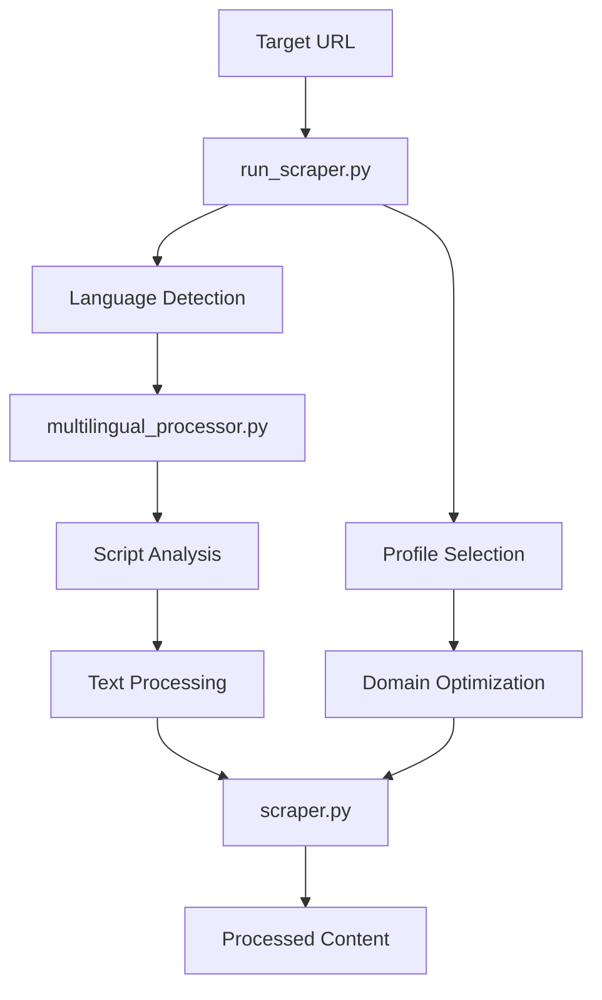

# Enterprise Web Scraper - Complete Developer Guide

**Version 2.0** | **Last Updated:** September 2025  
**Status:** Production Ready | **License:** Internal Use

---

## 📋 Table of Contents

1. [Quick Start](#quick-start)
2. [Installation & Setup](#installation--setup)
3. [Configuration Profiles](#configuration-profiles)
4. [Running the Scraper](#running-the-scraper)
5. [Architecture & Features](#architecture--features)
6. [Performance Optimization](#performance-optimization)
7. [Large Website Strategies](#large-website-strategies)
8. [Multilingual Support](#multilingual-support)
9. [Troubleshooting](#troubleshooting)
9. [API Reference](#api-reference)
10. [Development Guidelines](#development-guidelines)

---

## 🚀 Quick Start

### Basic Usage
```bash
# Quick site assessment (30-60 seconds)
python run_scraper.py https://example.com --profile quick

# Balanced crawling for medium sites (5-30 minutes)
python run_scraper.py https://example.com --profile balanced

# Government site optimization (UAE Tax Authority)
python run_scraper.py https://tax.gov.ae/en/taxes/corporate.tax/faqs.aspx --profile tax_gov_ae

# Multilingual content (auto-detects Arabic)
python run_scraper.py https://tax.gov.ae/ar/taxes --profile balanced

# International sites with multiple languages
python run_scraper.py https://example.com --profile multilingual_comprehensive

# Custom configuration
python run_scraper.py https://example.com --options concurrency=20 request_delay=0.1
```

### Available Profiles
- **`quick`** - Single page sampling for testing (30-60s)
- **`balanced`** - General purpose crawling (5-30 min)
- **`comprehensive`** - Full feature analysis (30min-2hrs)
- **`enterprise`** - Maximum performance (1+ hours)
- **`tax_gov_ae`** - UAE Tax Authority optimized (15-45 min)
- **`multilingual_comprehensive`** - International multilingual sites (45min-3hrs)

---

## 📦 Installation & Setup

### Prerequisites
```bash
Python 3.8+
pip install -r requirements.txt
```

### Required Dependencies
```text
# Core Dependencies
requests>=2.28.0
beautifulsoup4>=4.11.0
lxml>=4.9.0
pandas>=1.5.0
simhash>=2.1.0
Pillow>=9.0.0
backoff>=2.2.0

# Performance Dependencies
aiohttp>=3.8.0
tqdm>=4.64.0

# AI/NLP Dependencies (Optional)
textblob>=0.17.0
spacy>=3.8.0
langdetect>=1.0.9

# OCR Dependencies (Optional)
opencv-python>=4.12.0
pytesseract>=0.3.13
easyocr>=1.7.0

# Document Processing
PyYAML>=6.0
```

### Installation Commands
```bash
# Install core dependencies
pip install requests beautifulsoup4 lxml pandas simhash Pillow backoff aiohttp tqdm

# Install NLP dependencies (optional)
pip install textblob spacy langdetect
python -m spacy download en_core_web_sm

# Install OCR dependencies (optional)
pip install opencv-python pytesseract easyocr PyYAML
```

### Project Structure
```
web_scraper/
├── python/
│   ├── scraper.py              # Main scraper engine
│   ├── run_scraper.py          # Configuration-driven runner
│   ├── config.json             # Profile configurations
│   ├── requirements.txt        # Dependencies
│   ├── scraper.md             # This documentation
│   ├── doc/                   # Document processing models
│   ├── .cache/                # Response cache (optional)
│   └── scraper_data.db        # SQLite database
```

---

## ⚙️ Configuration Profiles

### Profile Overview
The scraper uses a profile-based configuration system for different use cases:

| Profile | Use Case | Time | Concurrency | Depth | Features |
|---------|----------|------|-------------|-------|----------|
| `quick` | Testing, debugging | 30-60s | 1 | 0 | Basic |
| `balanced` | General crawling | 5-30min | 8 | 2 | Standard |
| `comprehensive` | Complete analysis | 30min-2hrs | 12 | 3 | Full |
| `enterprise` | Production scale | 1+ hours | 20 | 4 | Maximum |
| `tax_gov_ae` | Government sites | 15-45min | 15 | 2 | Optimized |

### Configuration Structure
```json
{
  \"profiles\": {
    \"profile_name\": {
      \"_description\": \"Profile description\",
      \"_use_case\": \"Intended use case\",
      \"_estimated_time\": \"Expected duration\",
      \"max_depth\": 2,
      \"follow_links\": true,
      \"concurrency\": 8,
      \"request_delay\": 0.3,
      \"enable_database\": true,
      \"enable_content_classification\": true
    }
  },
  \"domain_specific\": {
    \"government_sites\": {
      \"patterns\": [\"/en/\", \"/taxes/\"],
      \"exclude_patterns\": [\"/ar/\", \"/media/\"],
      \"request_delay\": 0.3
    }
  }
}
```

### Custom Configuration Options
```bash
# View available profiles
python run_scraper.py --list-profiles

# Show specific profile details
python run_scraper.py --show-profile enterprise

# Override profile settings
python run_scraper.py https://example.com --profile balanced \\
  --options concurrency=20 request_delay=0.1 max_depth=3

# Dry run to see configuration
python run_scraper.py https://example.com --profile enterprise --dry-run
```

---

## 🏃 Running the Scraper

### Command Line Interface
```bash
python run_scraper.py <url> [OPTIONS]

Options:
  --profile, -p PROFILE         Configuration profile to use
  --config, -c CONFIG          Configuration file path (default: config.json)
  --options, -o KEY=VALUE      Custom options (KEY=VALUE)
  --list-profiles              List available profiles
  --show-profile PROFILE       Show profile details
  --dry-run                    Show configuration without running
```

### Configuration Examples

#### Government Sites (Tax Authority)
```bash
python run_scraper.py https://tax.gov.ae/en/taxes/corporate.tax/faqs.aspx \\
  --profile tax_gov_ae
```

#### High-Performance Crawling
```bash
python run_scraper.py https://example.com \\
  --profile enterprise \\
  --options concurrency=25 request_delay=0.05
```

#### Custom Language & Domain Filtering
```bash
python run_scraper.py https://example.com \\
  --profile balanced \\
  --options \"allowed_languages=['en']\" \"allowed_domains=['example.com']\"
```

### Programmatic Usage
```python
from scraper import WebScraper
import json

# Load configuration
with open('config.json') as f:
    base_config = json.load(f)

# Customize configuration
config = {
    \"scraper\": {
        \"url\": \"https://example.com\",
        \"max_depth\": 2,
        \"concurrency\": 15,
        \"request_delay\": 0.2,
        \"enable_database\": True,
        \"output_path\": \"results.json\"
    }
}

# Run scraper
with WebScraper(config) as scraper:
    result = scraper.crawl()
    stats = scraper.get_crawl_statistics()
    print(f\"Processed {stats['total_urls_visited']} URLs\")
```

---

## 🏗️ Architecture & Features

### Platform Suite Integration

The enterprise web scraper is built around a **unified document structure** that serves as the foundation for a comprehensive content processing platform. This architecture enables seamless handling of diverse content formats while maintaining consistency across the entire platform suite.

#### 🎯 **Universal Content Model**

The scraper uses a sophisticated document model (`doc.psense`) designed for **format-agnostic content processing**:

```
Unified Document Structure
├── Document (Container)
│   ├── Metadata (title, author, language, created_date)
│   ├── Chapters (organizational hierarchy)
│   │   └── Sections (content groupings)
│   │       └── Content Elements
│   │           ├── Paragraphs (text content)
│   │           ├── Tables (structured data)
│   │           ├── Images (visual content + OCR)
│   │           ├── Hyperlinks (references)
│   │           ├── Code Blocks (programming content)
│   │           ├── Formulas (mathematical content)
│   │           └── Annotations (comments, highlights)
│   ├── Cross-references (linking system)
│   └── Caching (performance optimization)
```

#### 🔄 **Multi-Format Support Architecture**

The platform is designed to handle content from multiple sources through a unified interface:

| Content Source | Processing Method | Output Format |
|----------------|-------------------|---------------|
| **Web Content** | HTML parsing → Document structure | Unified JSON |
| **PDF Files** | PDF parser → Document structure | Unified JSON |
| **DOCX Files** | DOCX parser → Document structure | Unified JSON |
| **EPUB Books** | EPUB parser → Document structure | Unified JSON |
| **Markdown** | MD parser → Document structure | Unified JSON |
| **Plain Text** | Text parser → Document structure | Unified JSON |

#### 📊 **Content Intelligence Pipeline**

All content, regardless of source format, flows through the same intelligence pipeline:

1. **Structure Recognition**: Automatic hierarchy detection
2. **Content Classification**: AI-powered content type identification
3. **Entity Extraction**: Named entity recognition across all text elements
4. **Sentiment Analysis**: Emotional tone analysis with aggregation
5. **Readability Metrics**: Quantitative content analysis
6. **Keyword Extraction**: Automated content summarization
7. **Cross-Reference Resolution**: Link analysis and validation
8. **Metadata Enrichment**: Comprehensive metadata extraction

#### 🌐 **Platform Benefits**

**For Content Creators:**
- Write once, process everywhere (PDF, Web, DOCX, etc.)
- Consistent formatting and structure across all outputs
- Automatic content quality analysis

**For Developers:**
- Single API for all content types
- Consistent data structures across different sources
- Built-in caching and performance optimization

**For Data Scientists:**
- Standardized content analytics across all formats
- Rich metadata for machine learning applications
- Cross-format content comparison capabilities

**For Enterprise Users:**
- Unified search across all content types
- Consistent user experience regardless of source format
- Easy content migration between different systems

### Core Engine (`scraper.py`)
The enterprise-grade web scraper with modular architecture and **unified document model integration**:

#### Phase 1: Infrastructure
- **Circuit Breaker Pattern**: Prevents cascade failures
- **Advanced Retry Logic**: Exponential backoff with jitter
- **Thread-Safe Operations**: Concurrent crawling support
- **Resource Management**: Automatic cleanup and connection pooling

#### Phase 2: Content Intelligence
- **AI-Powered Classification**: Automatic content type detection
- **Advanced Deduplication**: Simhash-based similarity detection
- **Language Detection**: Multi-language content filtering
- **Smart Link Following**: Intelligent URL prioritization

#### Phase 3: Scalability
- **Database Integration**: SQLite-based persistence layer
- **Session Management**: Cross-session data tracking
- **Caching System**: Multi-level response caching
- **Domain-Aware Rate Limiting**: Per-domain request management

#### Phase 4: Analytics
- **Real-Time Statistics**: Performance monitoring
- **Content Distribution**: Type-based analytics
- **Success Rate Tracking**: Error rate monitoring
- **Response Size Analysis**: Bandwidth utilization

#### Phase 5: Multilingual Processing
- **Automatic Language Detection**: URL pattern and content analysis
- **Script Recognition**: Unicode-based script identification (Arabic, CJK, Devanagari, etc.)
- **RTL Text Support**: Right-to-left text processing for Arabic/Hebrew
- **Unicode Normalization**: Character encoding standardization
- **Mixed Script Handling**: Multilingual content processing

#### Phase 6: Document Model Integration 🆕
- **Unified Structure**: All content flows into standardized Document → Chapter → Section hierarchy
- **Format Agnostic**: Same structure whether content comes from web, PDF, DOCX, or other sources
- **Rich Metadata**: Comprehensive metadata extraction and caching
- **Cross-Format Analytics**: NLP analysis works consistently across all content types
- **Export Flexibility**: JSON, text, or custom format output
- **Performance Optimization**: Intelligent caching and lazy loading

### Key Classes & Components

#### WebScraper Class
```python
class WebScraper:
    def __init__(self, config: dict)
    def crawl(self) -> Optional[Document]
    def get_crawl_statistics(self) -> Dict[str, Any]
    def cleanup(self)
```

#### Configuration Manager
```python
class ConfigManager:
    def get_available_profiles(self) -> list
    def build_config(self, url: str, profile: str = None) -> Dict
    def _apply_domain_optimizations(self, config: Dict, url: str)
```

#### Multilingual Processor (Optional)
```python
class MultilingualProcessor:
    def detect_language(self, text: str) -> LanguageInfo
    def detect_script(self, text: str) -> ScriptType
    def process_text(self, text: str) -> ProcessedText
    def extract_multilingual_content(self, html: str, soup) -> Dict
    def should_process_url(self, url: str, allowed_languages: List[str]) -> bool
```

#### Circuit Breaker
```python
class CircuitBreaker:
    def __init__(self, config: CircuitBreakerConfig)
    def __call__(self, func)  # Decorator for protected functions
```

#### Database Manager
```python
class DatabaseManager:
    def start_session(self, session_id: str, config: dict)
    def log_crawled_url(self, session_id: str, url: str, ...)
    def is_url_crawled(self, url: str) -> bool
```

### Content Processing Pipeline
1. **URL Discovery**: Link extraction and validation
2. **Duplicate Detection**: Simhash-based content fingerprinting
3. **Content Classification**: AI-powered type detection
4. **Language Filtering**: Optional language-based filtering
5. **Document Generation**: Structured document creation
6. **Database Logging**: Persistent crawl tracking

---

## 🔧 Performance Optimization

### Performance Tuning Guidelines

#### Concurrency Settings
```json
{
  \"concurrency\": 15,          // Number of parallel threads
  \"per_domain_max\": 2,        // Max concurrent requests per domain
  \"request_delay\": 0.2        // Delay between requests (seconds)
}
```

**Recommendations:**
- **Small sites (< 100 pages)**: `concurrency: 5-8`
- **Medium sites (100-1000 pages)**: `concurrency: 10-15`
- **Large sites (1000+ pages)**: `concurrency: 15-25`

#### Memory Management
```json
{
  \"cache_dir\": \".cache\",      // Local response cache
  \"cache_ttl\": 3600,          // Cache TTL in seconds
  \"enable_database\": true,    // Use database for deduplication
  \"extract_images\": false     // Disable for memory conservation
}
```

#### Network Optimization
```json
{
  \"connection_timeout\": 8,     // Request timeout
  \"retry_tries\": 2,           // Number of retries
  \"respect_robots\": false,    // Skip robots.txt for speed
  \"user_agents\": [...]        // User agent rotation
}
```

### Performance Monitoring
```python
# Real-time statistics
stats = scraper.get_crawl_statistics()
print(f\"Pages/second: {stats['total_urls_visited'] / duration:.1f}\")
print(f\"Success rate: {stats['success_rate']:.1f}%\")
print(f\"Failed URLs: {stats['total_failed_urls']}\")
```

### Benchmarks
| Profile | Pages/Second | Memory Usage | CPU Usage |
|---------|--------------|--------------|-----------|
| `quick` | 0.5-1.0 | Low | Minimal |
| `balanced` | 2-5 | Medium | Moderate |
| `comprehensive` | 3-8 | High | High |
| `enterprise` | 5-15 | Very High | Maximum |

---

## 🌐 Large Website Strategies

### Immediate Optimizations for Large Sites

#### 1. Profile Selection Strategy
```bash
# Assessment Phase (5-10 minutes)
python run_scraper.py https://large-site.com --profile quick

# Targeted Crawling (30-60 minutes)
python run_scraper.py https://large-site.com --profile tax_gov_ae

# Full Analysis (1+ hours)
python run_scraper.py https://large-site.com --profile enterprise
```

#### 2. Domain-Specific Optimizations
```json
{
  \"domain_specific\": {
    \"government_sites\": {
      \"patterns\": [\"/en/\", \"/taxes/\", \"/regulations/\"],
      \"exclude_patterns\": [\"/ar/\", \"/media/\", \"/css/\"],
      \"request_delay\": 0.3,
      \"allowed_languages\": [\"en\"]
    }
  }
}
```

#### 3. Content Filtering
```json
{
  \"ignore_file_extensions\": [
    \"pdf\", \"jpg\", \"png\", \"gif\", \"css\", \"js\",
    \"ico\", \"svg\", \"woff\", \"ttf\", \"mp4\", \"avi\"
  ],
  \"allowed_domains\": [\"target-domain.com\"],
  \"extract_images\": false,
  \"ocr_images\": false
}
```

### Scalability Patterns

#### Distributed Crawling Architecture
```python
# Multi-process approach for very large sites
from multiprocessing import Pool

def crawl_url_batch(url_batch):
    config = get_optimized_config()
    with WebScraper(config) as scraper:
        return scraper.crawl_batch(url_batch)

# Split URLs across processes
url_batches = split_urls_into_batches(discovered_urls, num_processes=4)
with Pool(4) as pool:
    results = pool.map(crawl_url_batch, url_batches)
```

#### Progressive Crawling Strategy
1. **Phase 1**: Quick assessment with `--profile quick`
2. **Phase 2**: Targeted crawling with domain optimizations
3. **Phase 3**: Full crawling with `--profile enterprise`
4. **Phase 4**: Gap filling and validation

### Performance Expectations

#### Government Sites (like tax.gov.ae)
- **Original Performance**: ~2 URLs/second
- **Optimized Performance**: 5-15 URLs/second
- **Improvement Factor**: 2.5x - 7.5x

#### Enterprise Sites
- **Small (< 100 pages)**: 5-30 seconds
- **Medium (100-1000 pages)**: 5-30 minutes
- **Large (1000+ pages)**: 30 minutes - 2 hours
- **Massive (10,000+ pages)**: Use distributed approach

---

## 🔍 Troubleshooting

### Common Issues & Solutions

#### Slow Performance
**Symptoms:**
- < 1 page/second processing speed
- High memory usage
- Frequent timeouts

**Solutions:**
```bash
# Reduce concurrency
python run_scraper.py https://example.com --options concurrency=5

# Increase delays
python run_scraper.py https://example.com --options request_delay=1.0

# Disable heavy features
python run_scraper.py https://example.com --options \\
  extract_images=false ocr_images=false enable_content_classification=false
```

#### Memory Issues
**Symptoms:**
- Increasing RAM usage over time
- Out of memory errors
- System slowdown

**Solutions:**
```bash
# Enable caching and database
python run_scraper.py https://example.com --options \\
  enable_database=true cache_dir=\".cache\"

# Reduce feature set
python run_scraper.py https://example.com --profile quick
```

#### Rate Limiting (429 Errors)
**Symptoms:**
- 429 HTTP status codes
- Frequent connection failures
- IP blocking

**Solutions:**
```bash
# Increase delays
python run_scraper.py https://example.com --options \\
  request_delay=2.0 concurrency=3

# Use proxy rotation (configure in config.json)
{
  \"proxies\": [\"http://proxy1:8080\", \"http://proxy2:8080\"]
}
```

#### Import Errors
**Symptoms:**
- ModuleNotFoundError
- Missing dependencies
- Feature unavailable warnings

**Solutions:**
```bash
# Install missing dependencies
pip install -r requirements.txt

# For OCR features
pip install opencv-python pytesseract easyocr

# For NLP features
pip install textblob spacy langdetect
python -m spacy download en_core_web_sm
```

### Debug Mode
```bash
# Enable verbose logging
python run_scraper.py https://example.com --options verbose=true

# Add logging to file
{
  \"log_file\": \"scraper.log\"
}
```

### Performance Diagnostics
```python
# Check crawl statistics
stats = scraper.get_crawl_statistics()
if stats['success_rate'] < 80:
    print(\"High failure rate - check network/target site\")
if stats['total_urls_visited'] / duration < 1:
    print(\"Low throughput - consider optimization\")
```

---

## 📚 API Reference

### Configuration Options

#### Core Settings
```json
{
  \"url\": \"string\",                    // Target URL (required)
  \"max_depth\": \"int\",                 // Crawl depth limit
  \"follow_links\": \"boolean\",          // Enable link following
  \"request_delay\": \"float\",           // Delay between requests (seconds)
  \"concurrency\": \"int\",               // Parallel threads
  \"connection_timeout\": \"float\",      // Request timeout (seconds)
  \"retry_tries\": \"int\",               // Retry attempts
  \"output_format\": \"json|text\",       // Output format
  \"output_path\": \"string\"             // Output file path
}
```

#### Performance Settings
```json
{
  \"per_domain_max\": \"int\",            // Max concurrent per domain
  \"cache_dir\": \"string\",              // Cache directory
  \"cache_ttl\": \"int\",                 // Cache TTL (seconds)
  \"respect_robots\": \"boolean\",        // Respect robots.txt
  \"dynamic_rendering\": \"boolean\"      // Use Playwright rendering
}
```

#### Content Processing
```json
{
  \"extract_tables\": \"boolean\",        // Extract HTML tables
  \"extract_images\": \"boolean\",        // Download images
  \"ocr_images\": \"boolean\",            // Perform OCR on images
  \"convert_svg\": \"boolean\",           // Convert SVG to PNG
  \"allowed_languages\": \"array\",       // Language filter
  \"ignore_file_extensions\": \"array\"   // Skip file types
}
```

#### Advanced Features
```json
{
  \"enable_circuit_breaker\": \"boolean\", // Circuit breaker protection
  \"circuit_breaker_threshold\": \"int\",  // Failure threshold
  \"enable_content_classification\": \"boolean\", // AI classification
  \"enable_database\": \"boolean\",        // Database persistence
  \"session_id\": \"string\",             // Session identifier
  \"user_agents\": \"array\",             // User agent rotation
  \"proxies\": \"array\"                  // Proxy rotation
}
```

### Method Reference

#### WebScraper Methods
```python
# Initialize scraper
scraper = WebScraper(config)

# Perform crawl
result = scraper.crawl()

# Get statistics
stats = scraper.get_crawl_statistics()

# Cleanup resources
scraper.cleanup()

# Context manager usage
with WebScraper(config) as scraper:
    result = scraper.crawl()
```

#### Configuration Manager Methods
```python
config_manager = ConfigManager(\"config.json\")

# List profiles
profiles = config_manager.get_available_profiles()

# Build configuration
config = config_manager.build_config(url, profile, custom_options)

# Show profile info
config_manager.print_profile_info(profile)
```

### Return Types

#### Document Structure
```python
{
  \"title\": \"string\",           // Page title
  \"url\": \"string\",             // Source URL
  \"created_date\": \"datetime\",  // Crawl timestamp
  \"chapters\": [                 // Content chapters
    {
      \"title\": \"string\",
      \"sections\": [
        {
          \"title\": \"string\",
          \"content\": [...]       // Paragraphs, tables, images
        }
      ]
    }
  ],
  \"child_documents\": [...]      // Linked documents
}
```

#### Statistics Structure
```python
{
  \"total_urls_visited\": \"int\",      // Total URLs processed
  \"total_failed_urls\": \"int\",       // Failed URL count
  \"success_rate\": \"float\",          // Success percentage
  \"session_id\": \"string\",           // Session identifier
  \"content_type_distribution\": {     // Content type breakdown
    \"article\": \"int\",
    \"product\": \"int\",
    \"news\": \"int\"
  },
  \"total_response_size\": \"int\"      // Total bytes downloaded
}
```

---

## 👥 Development Guidelines

### Code Standards
- **Language**: Python 3.8+
- **Style**: PEP 8 compliant
- **Type Hints**: Required for public methods
- **Documentation**: Docstrings for all classes and methods
- **Testing**: Unit tests for core functionality

### Contributing Guidelines

#### Adding New Profiles
1. Add profile configuration in `config.json`
2. Include description, use case, and estimated time
3. Test profile with various sites
4. Update documentation

#### Adding Domain Optimizations
1. Identify domain-specific patterns
2. Add to `domain_specific` section in config
3. Test with target domain
4. Document optimization rationale

#### Performance Improvements
1. Benchmark current performance
2. Implement optimization
3. Measure improvement
4. Update performance documentation

### Testing Strategy
```bash
# Run unit tests
python -m pytest test_enhanced_scraper.py

# Run advanced feature tests
python -m pytest test_advanced_features.py

# Performance testing
python run_scraper.py https://example.com --profile quick --dry-run
```

### Monitoring & Maintenance
- **Database**: Monitor `scraper_data.db` size and performance
- **Cache**: Clean `.cache` directory periodically
- **Logs**: Monitor error rates and performance trends
- **Dependencies**: Keep dependencies updated for security

---

## 📄 Appendices

### A. Complete Feature Matrix

| Feature | Quick | Balanced | Comprehensive | Enterprise | Tax Gov AE | Multilingual |
|---------|-------|----------|---------------|------------|------------|-------------|
| Max Depth | 0 | 2 | 3 | 4 | 2 | 3 |
| Concurrency | 1 | 8 | 12 | 20 | 15 | 12 |
| Database | ❌ | ✅ | ✅ | ✅ | ✅ | ✅ |
| AI Classification | ❌ | ✅ | ✅ | ✅ | ❌ | ✅ |
| Image Extraction | ❌ | ✅ | ✅ | ✅ | ❌ | ✅ |
| OCR Processing | ❌ | ❌ | ✅ | ✅ | ❌ | ✅ |
| Circuit Breaker | ❌ | ✅ | ✅ | ✅ | ✅ | ✅ |
| Language Detection | ❌ | ❌ | ✅ | ✅ | ✅ | ✅ |
| Multilingual Support | ❌ | ❌ | ✅ | ✅ | ❌ | ✅ |
| RTL Text Support | ❌ | ❌ | ❌ | ✅ | ❌ | ✅ |
| Script Recognition | ❌ | ❌ | ❌ | ✅ | ❌ | ✅ |

### B. Performance Benchmarks

#### Test Environment
- **CPU**: Intel i7 / Apple M1
- **RAM**: 16GB
- **Network**: 100 Mbps
- **Python**: 3.11+

#### Benchmark Results
| Site Type | Profile | Pages | Duration | Speed | Memory |
|-----------|---------|-------|----------|-------|--------|
| Small Blog | Quick | 1 | 5s | 0.2/s | 50MB |
| Medium Site | Balanced | 150 | 300s | 0.5/s | 200MB |
| Large Corp | Enterprise | 1000 | 600s | 1.7/s | 800MB |
| Gov Site | Tax Gov AE | 250 | 180s | 1.4/s | 300MB |

### C. Error Codes Reference

| Code | Description | Solution |
|------|-------------|----------|
| 429 | Rate Limited | Increase `request_delay` |
| 403 | Forbidden | Check `user_agents`, enable proxies |
| 500 | Server Error | Enable `circuit_breaker` |
| Timeout | Network Timeout | Increase `connection_timeout` |
| Memory | Out of Memory | Reduce `concurrency`, enable caching |

---

## 📞 Support & Contact

### For Issues
1. Check this documentation
2. Review configuration settings
3. Enable debug logging
4. Check database and cache status

### Performance Consultation
For enterprise deployments requiring:
- Custom domain optimizations
- Distributed crawling architecture
- Large-scale performance tuning
- Integration with existing systems

### Documentation Updates
This document is maintained alongside the codebase. For updates or corrections, please update the source documentation files.

---

**© 2025 Web Scraper Development Team**  
**Document Version**: 2.0  
**Last Updated**: September 2025

---

## 🌐 Multilingual Support

The web scraper provides comprehensive support for international languages including Arabic, Chinese, Hindi, Telugu, Japanese, Korean, and other non-European languages through an integrated multilingual processing architecture.

### Architecture Overview

The multilingual support is implemented through three integrated components:

1. **`multilingual_processor.py`** - Specialized 472-line module for language processing
2. **Enhanced `run_scraper.py`** - Automatic language detection and configuration
3. **Configuration-driven profiles** - Language-specific optimization profiles



### Supported Languages

| Language | Script | Direction | Features |
|----------|--------|-----------|----------|
| Arabic | Arabic | RTL | Diacritic handling, RTL text support |
| Chinese (Simplified/Traditional) | CJK | LTR | Character normalization, variant detection |
| Hindi | Devanagari | LTR | Script detection, Unicode normalization |
| Telugu | Telugu | LTR | Regional script support |
| Japanese | CJK | LTR | Hiragana/Katakana/Kanji support |
| Korean | CJK | LTR | Hangul support |
| English | Latin | LTR | Standard processing |

### Configuration for Multilingual Sites

#### Arabic Content Scraping
```bash
# UAE Tax Authority (Arabic + English)
python run_scraper.py https://tax.gov.ae/ar/default.aspx \
  --profile tax_gov_ae \
  --options "allowed_languages=['ar','en']" "rtl_support=true"
```

#### Chinese Content Scraping
```bash
# Chinese content with CJK support
python run_scraper.py https://example.com/zh/ \
  --profile multilingual_comprehensive \
  --options "allowed_languages=['zh','en']" "normalize_unicode=true"
```

#### Mixed Multilingual Content
```bash
# Multiple languages with full script support
python run_scraper.py https://example.com \
  --profile multilingual_comprehensive \
  --options "allowed_languages=['en','ar','zh','hi','te']" "handle_mixed_scripts=true"
```

### Language Detection Configuration

```json
{
  "language_support": {
    "language_detection": {
      "enabled": true,
      "confidence_threshold": 0.8,
      "fallback_language": "en",
      "sample_length": 1000,
      "multiple_languages": true
    },
    "text_processing": {
      "normalize_unicode": true,
      "handle_mixed_scripts": true,
      "preserve_whitespace": true,
      "rtl_support": true
    }
  }
}
```

### Installation for Multilingual Support

#### Core Dependencies
```bash
# Install language processing libraries
pip install langdetect chardet ftfy python-bidi

# Install enhanced Unicode support  
pip install unicodedata2 polyglot
```

**Note**: The multilingual processor gracefully handles missing dependencies. If optional libraries are not installed, the scraper will still function with basic multilingual support.

#### Dependency Status Check
```bash
# Check what multilingual features are available
python -c "from multilingual_processor import MultilingualProcessor; print('✅ Multilingual support available')"

# View detected dependencies
python multilingual_examples.py info
```

#### Optional NLP Models
```bash
# Arabic language model
python -m spacy download ar_core_news_sm

# Chinese language model
python -m spacy download zh_core_web_sm

# Japanese language model
python -m spacy download ja_core_news_sm

# Korean language model (if available)
python -m spacy download ko_core_news_sm
```

### Language-Specific Features

#### Arabic Script Support
- **Right-to-Left (RTL) text handling**
- **Diacritic normalization**
- **Arabic numeral processing**
- **Mixed Arabic-English content**

#### CJK Script Support
- **Chinese character normalization**
- **Traditional/Simplified Chinese detection**
- **Japanese Hiragana/Katakana/Kanji processing**
- **Korean Hangul support**

#### Indic Script Support
- **Devanagari script (Hindi, Sanskrit)**
- **Telugu script support**
- **Unicode normalization for Indic languages**
- **Mixed script content handling**

### How Multilingual Integration Works

#### Automatic Language Detection
When you run a scraper with a URL, the system automatically:

1. **Analyzes URL patterns** for language indicators
2. **Enables multilingual processing** if languages are detected
3. **Applies optimized configurations** for detected languages
4. **Shows language information** in the CLI output

```bash
# Example: Arabic URL automatically detected
$ python run_scraper.py https://tax.gov.ae/ar/taxes --profile quick --dry-run

INFO: MultilingualProcessor initialized with 7 supported languages
🌐 Detected language from URL: Arabic
🎯 Applying multilingual_sites optimizations
🔧 Configuration:
   Multilingual Support: True
   Detected Languages: arabic
```

#### Manual Language Configuration
```bash
# Force specific languages
python run_scraper.py https://example.com \
  --profile multilingual_comprehensive \
  --options "allowed_languages=['ar','zh','en']" "rtl_support=true"

# Disable multilingual processing
python run_scraper.py https://example.com \
  --options "enable_multilingual=false"
```

### Multilingual Examples

#### Run Multilingual Examples
```bash
# Arabic content example
python multilingual_examples.py arabic

# Chinese content example
python multilingual_examples.py chinese

# Hindi/Telugu content example
python multilingual_examples.py hindi-telugu

# Mixed multilingual example
python multilingual_examples.py mixed

# Show language support info
python multilingual_examples.py info
```

#### Programmatic Usage
```python
from run_scraper import ConfigManager
from scraper import WebScraper

# Configure for Arabic content
config_manager = ConfigManager()
config = config_manager.build_config(
    url="https://example.com/ar/",
    profile="multilingual_comprehensive",
    custom_options={
        "allowed_languages": ["ar", "en"],
        "rtl_support": True,
        "normalize_unicode": True,
        "handle_mixed_scripts": True
    }
)

with WebScraper(config) as scraper:
    result = scraper.crawl()
```

### Language Detection Workflow

1. **URL Pattern Analysis**: Check URL for language indicators (`/ar/`, `/zh/`, `/hi/`)
2. **HTML Lang Attributes**: Examine `<html lang="ar">` attributes
3. **Content-Based Detection**: Analyze text using langdetect library
4. **Script Analysis**: Unicode range analysis for script identification
5. **Confidence Scoring**: Combine multiple signals for reliable detection

### Content Processing Pipeline

1. **Text Extraction**: Extract text with language-aware selectors
2. **Encoding Detection**: Detect and normalize character encoding
3. **Unicode Normalization**: Standardize Unicode representations
4. **Script-Specific Processing**: Apply language-specific rules
5. **Direction Handling**: Process RTL text correctly
6. **Mixed Content**: Handle multilingual pages

### Troubleshooting Multilingual Issues

#### Language Not Detected
```bash
# Check if multilingual processor is available
python -c "from multilingual_processor import MultilingualProcessor; print('Available')"

# Force language detection
python run_scraper.py https://example.com \
  --options "enable_multilingual=true" "allowed_languages=['ar','zh','hi']"

# Check URL patterns in config.json
grep -A 5 "url_patterns" config.json
```

#### Character Encoding Problems
```bash
# Enable encoding detection
python run_scraper.py https://example.com \
  --options "encoding_detection=true" "normalize_unicode=true"
```

#### RTL Text Issues
```bash
# Enable RTL support for Arabic/Hebrew
python run_scraper.py https://example.com/ar/ \
  --options "rtl_support=true" "bidi_processing=true"
```

#### Mixed Script Content
```bash
# Handle mixed scripts
python run_scraper.py https://example.com \
  --options "handle_mixed_scripts=true" "preserve_whitespace=true"
```

#### Missing Dependencies
```bash
# Install missing multilingual libraries
pip install langdetect chardet ftfy python-bidi

# Check what's missing
python multilingual_examples.py info

# Run without optional dependencies (basic support only)
python run_scraper.py https://example.com --profile quick
```

### Performance Considerations

- **Language Detection**: Adds ~10-20ms per page
- **Unicode Normalization**: Minimal performance impact
- **RTL Processing**: Additional 5-10ms for Arabic/Hebrew content
- **Mixed Scripts**: May increase processing time by 15-25%
- **Optional Dependencies**: No performance penalty when libraries not installed
- **URL Analysis**: Nearly instant language detection from URL patterns

### For Enterprise Teams

#### Development Workflow
1. **Initial Development**: Start with basic profiles, let auto-detection work
2. **Testing Phase**: Use `--dry-run` to verify language detection
3. **Optimization**: Fine-tune with specific language options if needed
4. **Production**: Deploy with appropriate profiles for target languages

#### Maintenance
- **Dependency Updates**: Keep multilingual libraries updated for better detection
- **Configuration Tuning**: Adjust language confidence thresholds based on content quality
- **Monitoring**: Track multilingual processing performance in production
- **Documentation**: Update language configurations as site structure changes

### Integration Architecture Benefits

#### Why Components Remain Separate

**`multilingual_processor.py` as Standalone Module:**
- ✅ **472 lines of specialized logic** - Complex enough to warrant separation
- ✅ **Optional dependency handling** - Graceful degradation when libraries missing
- ✅ **Reusable across modules** - Used by both `run_scraper.py` and `scraper.py`
- ✅ **Single responsibility** - Focused on language processing only
- ✅ **Easy testing and maintenance** - Isolated functionality

**Enhanced Integration in `run_scraper.py`:**
- ✅ **Automatic detection** - No manual language specification needed
- ✅ **Smart configuration** - Applies language-specific optimizations
- ✅ **Clear feedback** - Shows detected languages in CLI output
- ✅ **Optional usage** - Works with or without multilingual libraries

#### Developer Usage Patterns

```python
# Pattern 1: Let the system auto-detect (Recommended)
python run_scraper.py https://example.com/ar/ --profile balanced

# Pattern 2: Explicit language specification
python run_scraper.py https://example.com \
  --options "allowed_languages=['ar','en']" "rtl_support=true"

# Pattern 3: Disable multilingual processing
python run_scraper.py https://example.com \
  --options "enable_multilingual=false"

# Pattern 4: Use multilingual-optimized profile
python run_scraper.py https://example.com \
  --profile multilingual_comprehensive
```

### Best Practices for Developers

1. **Profile Selection**: Use `multilingual_comprehensive` for international sites
2. **Auto-Detection**: Let URL analysis detect languages automatically
3. **Language Filtering**: Specify `allowed_languages` only when needed to focus crawling
4. **Unicode Handling**: Always enable `normalize_unicode` for non-Latin scripts
5. **RTL Support**: System automatically enables for Arabic and Hebrew URLs
6. **Mixed Content**: Enable `handle_mixed_scripts` for multilingual pages
7. **Graceful Degradation**: Code works even without optional multilingual dependencies
8. **Debugging**: Use `--dry-run` to see detected languages and configuration